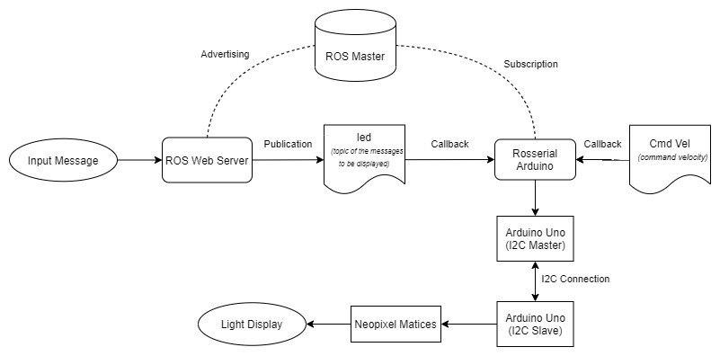
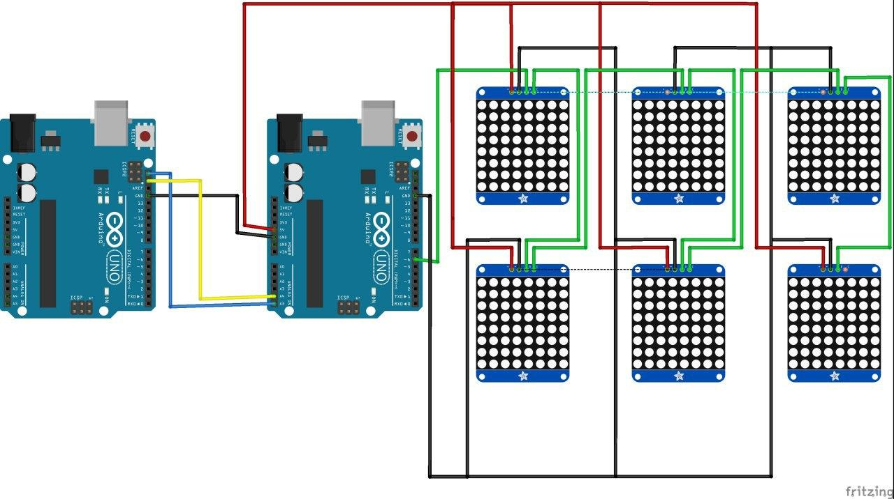
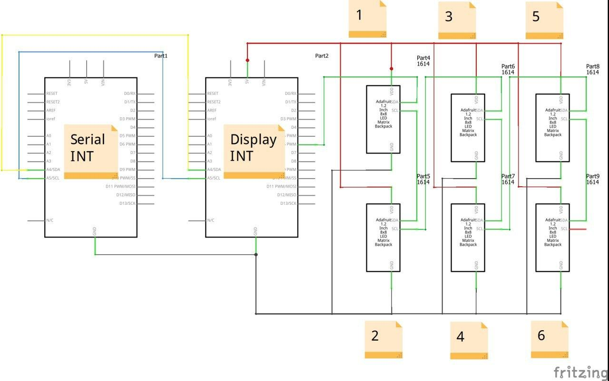

# NEOPIXEL MATRIX - ROS

This project involves the integration of ROS and Arduino so as to recieve a message from ROS and display animation/text on the matrix display attached to the MOMO robot.
The display will flash green arrow keys when the robot is moving and red colour when it is stopping. It also allows for a scrolling text message to be displayed on it, of which the text will be sent from a wepage using ROS Server.

## The Big Picture

 Figure 1.1 The Big Picture</img>

## Hardware

The hardware involved is 2 set of Arduino Unos and a total of 12 8x8 Neopixel matrices. 6 on each side of the MOMO bot. The matrices are configured in a 3x2 position. The Serial Interface is connected to ROS and the a Wepage, via ROS Server, where the message to displayed is recieved. The Arduino involved in the serial interface is connected to the other arduino involved in the display interface via I2C and communicates via pins A4 and A5. Pin 6 is the data pin that is routed to the Neopixel matrices.

 Figure 1.2 Fritzing Breadboard layout</img>

 
 

 Figure 1.3 Fritzing Schematics layout</img>

##Software
The repository includes 2 set of Arduino code. One for the I2C Master(Serial Interface) and one for the I2C Slave(Display Interface)

There is also a set of HTML, CSS & JS code for a webpage which is connected to the ROS Mastere via ROS Server. This webpage allows a person to send messages to be displayed onto the Neopixel Matrix.

##Code
In the repository there are a set 2 INO files one for the I2C Master, which is hooked up to the ROS Master and one for the I2C slave which is connected to the Neopixel Matrices.

I_2C_Master: This set of code is for the Arduino Uno that runs as a I2C Master as well as a Rosserial-Arduino Node subscribed to the "led" ROS Topic. It relays the messages from the ROS topic to the Slave via I2C.

I_2C_Slave: This Arduino Uno runs as an I2C slave which recieves the message from the master in bytes and the executes the scrolling text function which displays the string sent over on the Neopixel Matrix display.

